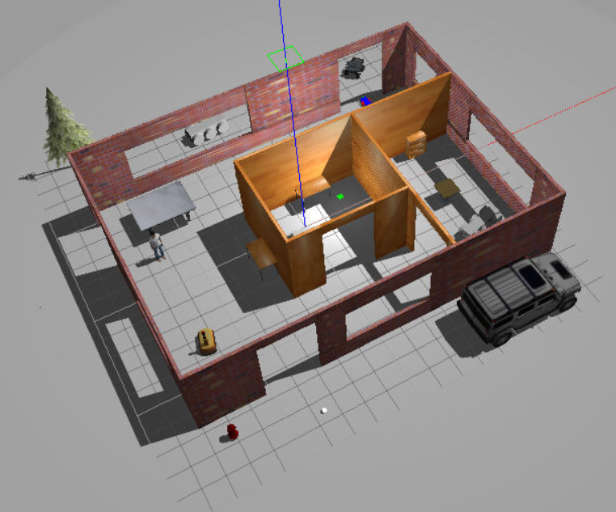

# gazebo_world
Design of a Gazebo World environment with multiple models and features.

Single floor wall structure incorporating multiple features, colours, and textures. 
Multiple instances of two different robot models, "robot" and "tank". 
Includes different models from the Gazebo online library. 
Welcome message is displayed upon launch of the Gazebo world file. 




## Project Folder

- model folder:
  - "robot" robot designed in the Model Editor tool of Gazebo
  - "tank" robot designed in the Model Editor tool of Gazebo
  - A single floor structure designed in the Building Editor tool of Gazebo
- world folder:
  - Gazebo world file that includes the models
- script folder:
  - Gazebo world plugin C++ script
- CMakeLists.txt file to link the C++ code to libraries


## Building
Prerequisites/Dependencies: [Gazebo](http://gazebosim.org/) and ROS. 

With the prerequisites met, source global ros: 
```
$ source /opt/ros/<your_ros_version>/setup.bash
```
Create a catkin workspace:
```
$ mkdir -p catkin_ws/src && cd catkin_ws
```
Clone the driver:
```
$ git clone https://github.com/barrymulvey/gazebo_world.git src/gazebo_world
```
Install dependencies:
```
$ sudo apt update -qq
$ rosdep update
$ rosdep install --from-paths src --ignore-src -y
```
Build the workspace:
```
$ catkin_make
```
Activate the workspace:
```
$ source devel/setup.bash
```
Launch the world file in Gazebo:
```
$ cd /build_world/world/
$ gazebo myworld
```
